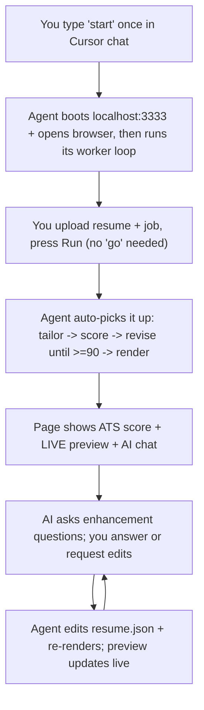

# CV Generator

Tailor your resume to a specific job, optimize it to pass ATS, and render a
clean, human-sounding PDF — **using your IDE's AI, not a paid API key.**

The twist: the AI engine is **your Cursor agent**. A tiny local web app collects
your resume and the job details; when you press **Run**, the agent (running its
worker loop in your chat) reads everything, rewrites and reorders your resume for
the role, keyword-optimizes it for ATS, and renders the PDF. Then it opens a
**chat right in the page**: it asks you smart questions to make the CV stronger,
and you can ask for any change — edits appear on a **live preview** as you talk.
You type `start` once; after that, **everything happens in the browser** — you
never go back to the IDE. Your data and the AI both stay on your machine.



## Requirements

- **Node.js 18+**
- **Cursor** (or any IDE agent that reads `AGENTS.md` and can view images).
  The agent must be able to see screenshots if you upload them.

## Setup

```bash
git clone <this-repo>
cd "CV Generator"
# open the folder in Cursor
```

The first `start` runs `npm install` for you (Puppeteer downloads a headless
Chromium the first time, ~1–2 min).

## Usage

1. In the Cursor chat, type:

   ```
   start
   ```

2. The agent installs deps (first time), launches the app at
   **http://localhost:3333**, and opens it in your browser.
3. In the browser:
   - Drop in your **current resume** (PDF / DOCX / TXT), or paste the text.
   - Add the **job**: paste the title, description, requirements, responsibilities
     and company info — **or** drop **LinkedIn screenshots** of the posting.
   - Pick an accent color and page size.
   - Press **Run — tailor my resume**. (You do **not** need to go back to the
     chat and say "go" — the agent's worker loop picks it up automatically.)
4. Watch the progress (reading → tailoring → scoring → rendering), then the page
   turns into a **live preview + AI chat**:
   - The assistant greets you with your ATS score and asks a few **specific
     questions** that could make the CV stronger (things you might not think to
     mention — a tool you know, a number behind a win, leadership you downplayed).
   - **Answer in the chat, or just tell it what to change** ("make the summary
     shorter", "drop the real-estate job", "use a darker accent"). Every edit is
     applied to the resume and the **preview updates live**.
   - Download the PDF whenever you're happy.

> The Cursor **agent session** is the engine, so keep it running — but you do all
> your work in the browser. Run as many jobs as you like; the loop picks up each
> new submission and each chat message on its own.

## What it optimizes

- **ATS score (target ≥ 90):** transparent, Jobscan-style scoring — keyword and
  hard-skill coverage vs the job description, title match, standard sections,
  parseable contact info, and format/length. The agent revises until it hits the
  target (truthfully) or reports exactly what's blocking it.
- **Recruiter appeal:** a clean, single-column, modern layout and sharp,
  specific writing tailored to the role.
- **Authentic voice:** written like a real person — which reads better to HR and
  avoids the generic patterns that "AI text" detectors look for.

## Honest expectations

No tool can literally **guarantee** a job offer, and no tool can **guarantee**
bypassing every AI-detector. This system maximizes what's actually in your
control: ATS pass-rate, precise role fit, presentation, and natural writing.

**It will not lie for you.** The agent only rephrases, reframes, reorders and
emphasizes your *real* experience. It never invents employers, titles, dates,
degrees, certifications, or skills you don't have. Genuine gaps are surfaced in
the report with suggestions — not faked on the resume. You can adjust the
truthfulness/aggressiveness in [`AGENTS.md`](AGENTS.md), but fabricating
verifiable facts is off the table.

## How it works (internals)

| Piece | Role |
| --- | --- |
| [`server.js`](server.js) | Express app on :3333. Collects inputs, serves outputs + chat. No AI. |
| [`AGENTS.md`](AGENTS.md) | The protocol your Cursor agent follows. This is the engine spec. |
| [`src/extract.js`](src/extract.js) | PDF/DOCX/TXT → text on upload. |
| [`src/atsScore.js`](src/atsScore.js) | Deterministic ATS scorer + missing-keyword list. |
| [`src/render.js`](src/render.js) | `resume.json` → filled HTML → selectable-text PDF (Puppeteer). |
| [`src/status.js`](src/status.js) | Lets the agent update run progress from the shell. |
| [`src/watch.js`](src/watch.js) | The worker-loop watcher: blocks until a new run or chat message, so the agent acts without you returning to the IDE. |
| [`src/chat.js`](src/chat.js) | The agent's side of the chat: ask questions, reply, and pull the user's messages. |
| [`template/`](template) | ATS-safe single-column resume template + CSS. |
| `runs/<id>/` | Per-run inputs, working files, outputs, and `chat/` (git-ignored). |

The agent writes the tailored `runs/<id>/work/resume.json`; the scorer and
renderer are plain Node scripts the agent calls.

## Project layout

```
server.js            AGENTS.md         README.md
src/   extract.js  atsScore.js  render.js  status.js  watch.js  chat.js
template/  resume.html  resume.css
public/    index.html  app.js
runs/      (generated per run, git-ignored)
```

## Troubleshooting

- **Port 3333 in use:** `PORT=4444 npm start` (then open that port).
- **Puppeteer / Chromium issues:** `node node_modules/puppeteer/install.mjs` to
  re-download the bundled browser.
- **Nothing happens after Run (or chat):** the agent session must be running its
  worker loop (`node src/watch.js` in a loop). If you closed it, type `start`
  again — your in-progress run is picked up where it left off.

## License

MIT
